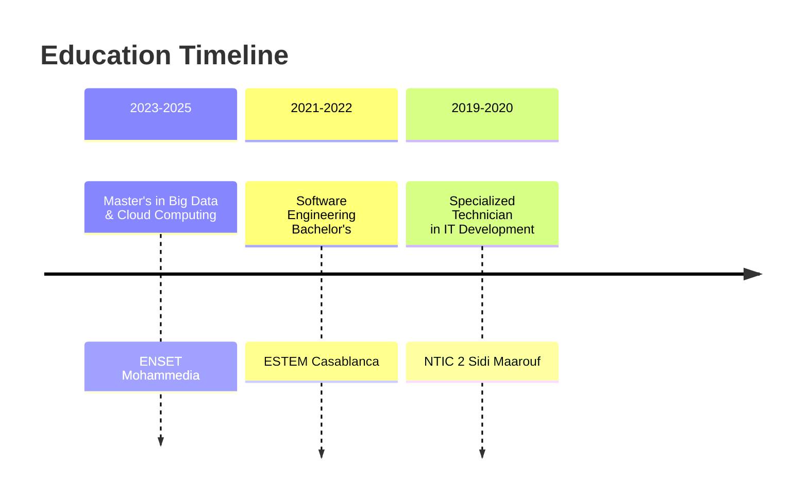

<div align="center">

<!-- Animated Header -->
<h1 align="center">
  <a href="https://git.io/typing-svg">
    
  </a>
</h1>

<!-- Animated Badges -->
<p align="center">
  
  
  
  
  
  
</p>

</div>

---

## 📊 **About Me**

<div align="center">

<!-- Animated stats -->


</div>

**Senior Full Stack Engineer** with **4+ years** of experience building scalable web and mobile applications across multiple industries including **banking, fintech, logistics, e-commerce, and telecom**. Currently pursuing a Master's in **Big Data & Cloud Computing** while leading development teams and integrating cutting-edge technologies like AI and OCR.

### 🎯 **Core Expertise**
- **Frontend Architecture:** React, React Native, Angular, Next.js, TypeScript
- **Backend Development:** Spring Boot (Java), Node.js, Microservices, REST APIs
- **Mobile Development:** React Native, Expo, iOS/Android Deployment
- **AI & Automation:** OCR integration, Image Processing, Fraud Detection
- **Cloud & DevOps:** Docker, Linux, CI/CD, Performance Optimization

---

## 🌟 **Featured Open Source Project**

<div align="center">

### 🎨 **ResumeCraft - Professional Resume Builder**

[](https://resume-editor-delta-rouge.vercel.app/)
[](https://github.com/HamzaBoulahia/resume-editor)

</div>

**ResumeCraft** is a modern, feature-rich web application that allows professionals to create stunning resumes with ease. Built with cutting-edge technologies and designed for both aesthetics and functionality.

### 🚀 **Key Features:**
- ✅ **ATS-Friendly Formatting** - Pass through Applicant Tracking Systems seamlessly
- ✅ **Modern & Creative Templates** - Multiple professionally designed layouts
- ✅ **Real-time Preview** - See changes instantly as you edit
- ✅ **Export Options** - PDF, DOCX, and plain text formats
- ✅ **AI-Powered Suggestions** - Get intelligent content recommendations
- ✅ **Responsive Design** - Works perfectly on all devices
- ✅ **Dark/Light Mode** - Choose your preferred theme
- ✅ **Cloud Storage** - Save and access your resumes from anywhere

### 🛠️ **Tech Stack:**
```javascript
const resumeCraftStack = {
  frontend: ["React", "TypeScript", "Tailwind CSS", "Framer Motion"],
  backend: ["Node.js", "Express", "MongoDB"],
  features: ["PDF Generation", "AI Integration", "Real-time Sync", "Cloud Storage"],
  deployment: ["Vercel", "MongoDB Atlas", "Cloudinary"]
};
```

**👉 [Try ResumeCraft Now](https://resume-editor-delta-rouge.vercel.app/)**

---

## 💼 **Professional Experience**

<table>
  <tr>
    <td width="60%" valign="top">

### 🏢 **Exia Technologies Casablanca** *(July 2022 – Present)*
**Full Stack Engineer - React & React Native | Angular, Spring Boot**

- Architected and deployed full-stack solutions using React, Angular, React Native, and Spring Boot
- Led integration of advanced technologies including AI and OCR for business process optimization
- Mentored junior developers through code reviews and best practices implementation
- Reduced critical bugs by 25% through rigorous testing protocols
- Managed cross-functional collaboration on complex technical requirements

### 🏢 **2WLS** *(Previous Position)*
**React & React Native Developer**

- Optimized development workflows using Docker
- Maintained and improved production applications supporting thousands of users
- Participated in client meetings and requirement analysis

    </td>
    <td width="40%" valign="top">

### 🏆 **Key Achievements**
- ✅ Built banking systems with AI-powered fraud detection
- ✅ Published private NPM packages for reusable components
- ✅ Deployed apps to App Store & Play Store with 10k+ users
- ✅ Integrated OCR reducing manual data entry by 70%
- ✅ Developed loyalty apps for major brands (Shell, TotalEnergies)

    </td>
  </tr>
</table>

---

## 📚 **Education & Continuous Learning**

<div align="center">

<!-- Education Timeline -->


</div>

---

## 🛠️ **Tech Stack Visualization**

<div align="center">

```javascript
const techStack = {
  languages: ["JavaScript", "TypeScript", "Java", "SQL", "HTML/CSS"],
  frontend: {
    frameworks: ["React", "React Native", "Angular", "Next.js"],
    stateManagement: ["Redux", "Context API", "RxJS"],
    styling: ["Tailwind CSS", "Styled-Components", "Material-UI"]
  },
  backend: {
    java: ["Spring Boot", "Spring Batch", "Spring Security"],
    nodejs: ["Express", "NestJS", "Socket.io"],
    architecture: ["Microservices", "REST APIs", "WebSockets", "GraphQL"]
  },
  databases: ["PostgreSQL", "MongoDB", "MySQL", "Redis"],
  devOps: ["Docker", "Linux", "Git", "CI/CD", "AWS", "Nginx"],
  specialties: ["OCR Integration", "AI/ML", "Image Processing", "Performance Optimization"]
};
```

</div>

---

## 📈 **GitHub Activity**

<div align="center">

<!-- GitHub Streak -->
[](https://git.io/streak-stats)

<!-- Activity Graph -->
[](https://github.com/ashutosh00710/github-readme-activity-graph)

</div>

---

## 📫 **Connect With Me**

<div align="center">

<!-- Animated Social Links -->
<p align="center">
  <a href="mailto:hamzaboulahia.code@gmail.com">
    
  </a>
  <a href="https://linkedin.com/in/boulahia-hamza">
    
  </a>
  <a href="https://resume-editor-delta-rouge.vercel.app/">
    
  </a>
  <a href="https://github.com/HamzaBoulahia?tab=repositories">
    
  </a>
</p>

<!-- Visitor Counter -->
<p align="center">
  
</p>

</div>

---

<div align="center">

<!-- Footer Quote -->


</div>
