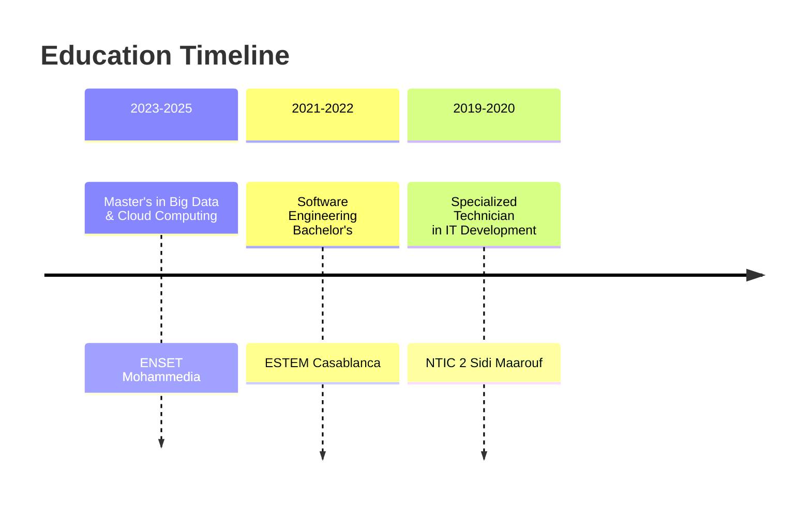

<div align="center">

<!-- Animated Header -->
<h1 align="center">
  <a href="https://git.io/typing-svg">
    
  </a>
</h1>

<!-- Animated Badges -->
<p align="center">
  
  
  
  
  
  
</p>

</div>

---

## 📊 **GitHub Stats**

<div align="center">

<!-- WORKING GitHub Stats -->


<!-- WORKING Top Languages -->


<!-- GitHub Streak (Alternative) -->
[](https://git.io/streak-stats)

<!-- GitHub Trophies -->


</div>

---

## 🎯 **About Me**

**Senior Full Stack Engineer** with **4+ years** of experience building scalable web and mobile applications across banking, fintech, logistics, e-commerce, and telecom. Currently pursuing a Master's in **Big Data & Cloud Computing** while leading development teams and integrating cutting-edge technologies like AI and OCR.

### 🛠️ **Tech Stack**
```javascript
const techStack = {
  frontend: ["React", "React Native", "Angular", "Next.js", "TypeScript"],
  backend: ["Spring Boot", "Node.js", "Java", "REST APIs", "WebSockets"],
  mobile: ["React Native", "Expo", "iOS/Android Deployment", "Push Notifications"],
  databases: ["PostgreSQL", "MongoDB", "MySQL", "Redis"],
  devOps: ["Docker", "Linux", "Git", "CI/CD", "AWS"],
  specialties: ["OCR Integration", "AI/ML", "Image Processing", "Fraud Detection"]
};
```

---

## 🌟 **Featured Project: ResumeCraft**

<div align="center">

### 🎨 **ResumeCraft - Professional Resume Builder**

[](https://resume-editor-delta-rouge.vercel.app/)
[](https://github.com/HamzaBoulahia/resume-editor)

</div>

**A modern, feature-rich web application for creating ATS-friendly resumes with beautiful templates.**

### 🚀 **Key Features:**
- ✅ **ATS-Compatible** - Pass through Applicant Tracking Systems
- ✅ **Multiple Templates** - Modern, creative designs
- ✅ **Real-time Preview** - Instant visual feedback
- ✅ **Export Options** - PDF, DOCX, and plain text
- ✅ **AI Suggestions** - Intelligent content recommendations
- ✅ **Cloud Storage** - Access from anywhere
- ✅ **Responsive Design** - Works on all devices

**Tech Stack:** React, TypeScript, Tailwind CSS, Node.js, MongoDB, Vercel

**👉 [Try ResumeCraft Now](https://resume-editor-delta-rouge.vercel.app/)**

---

## 💼 **Professional Experience**

### 🏢 **Exia Technologies Casablanca** *(July 2022 – Present)*
**Full Stack Engineer - React & React Native | Angular, Spring Boot**
- Architected full-stack solutions using React, Angular, React Native, and Spring Boot
- Integrated AI and OCR technologies for business process optimization
- Mentored junior developers through code reviews and best practices
- Reduced critical bugs by 25% through rigorous testing protocols

### 🏢 **2WLS** *(Previous Position)*
**React & React Native Developer**
- Optimized development workflows using Docker
- Maintained production applications supporting thousands of users
- Participated in client meetings and requirement analysis

---

## 📚 **Education**



---

## 📫 **Connect With Me**

<div align="center">

<p align="center">
  <a href="mailto:hamzaboulahia.code@gmail.com">
    
  </a>
  <a href="https://linkedin.com/in/boulahia-hamza">
    
  </a>
  <a href="https://resume-editor-delta-rouge.vercel.app/">
    
  </a>
  <a href="https://github.com/HamzaBoulahia?tab=repositories">
    
  </a>
</p>

<!-- Profile Views Counter -->
<p align="center">
  
</p>

</div>

---

<div align="center">

<!-- Footer Quote -->


</div>
