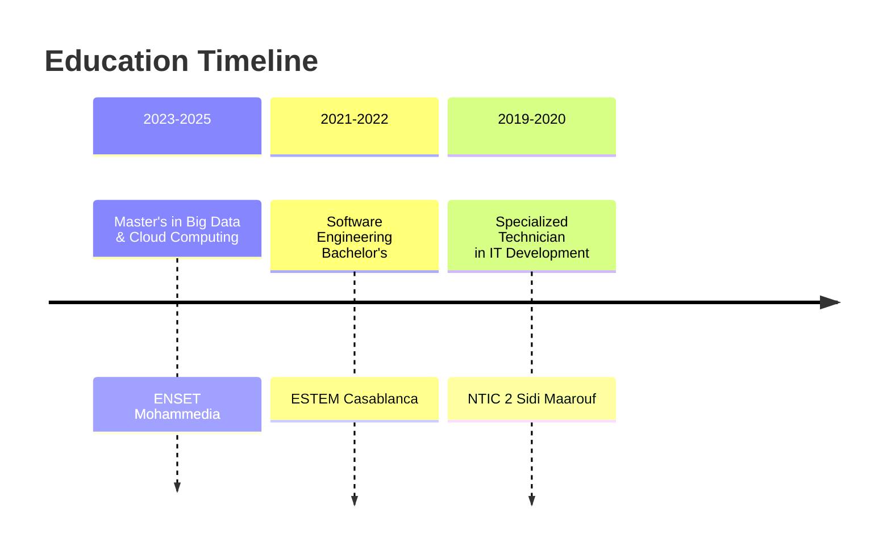

<!-- Animated Header -->
<h1 align="center">
  
</h1>

**Building scalable, user-centric applications with modern technologies. Senior engineer with 5 years of experience across fintech, banking, e-commerce, and enterprise solutions.**

---

## 🎯 About Me

Senior Full Stack Engineer with **4+ years** of proven expertise building production-grade web and mobile applications. Currently pursuing a **Master's in Big Data & Cloud Computing** while leading development initiatives and architecting scalable solutions.

**Specializations:**
- Full-stack development with React, React Native, and Spring Boot
- AI/OCR integration and image processing
- Fintech and banking systems
- Cloud deployment and DevOps

---

## 💻 Tech Stack

### Frontend

### Backend

### Databases & DevOps

### Specialties

---

## ⭐ Featured Project: ResumeCraft

### Professional Resume Builder with AI

> A modern, intelligent resume builder designed to create ATS-friendly resumes with beautiful templates and AI-powered suggestions.

**[🎯 Try Live Demo](https://resume-editor-delta-rouge.vercel.app/)** | **[📂 View Source Code](https://github.com/HamzaBoulahia/resume-editor)**

**Key Features:**
- ✅ ATS-Optimized Templates
- ✅ Real-time Preview & Editing
- ✅ Multiple Export Formats (PDF, DOCX, TXT)
- ✅ AI Content Suggestions
- ✅ Cloud Storage Integration
- ✅ Fully Responsive Design
- ✅ One-Click Deploy

**Tech Stack:** React • TypeScript • Tailwind CSS • Node.js • MongoDB • Vercel

---

## 💼 Professional Experience

### **Full Stack Engineer** — Exia Technologies
**July 2022 – Present** | Casablanca

Led the design and deployment of full-stack enterprise solutions serving fintech and banking clients.

**Key Achievements:**
- Architected and deployed full-stack solutions using React, Angular, React Native, and Spring Boot
- Reduced critical bugs by 25% through implementation of rigorous testing protocols and coding best practices
- Mentored junior developers through comprehensive code reviews and architectural guidance
- Integrated AI and OCR technologies for business process optimization and fraud detection
- Managed cross-functional collaboration on complex technical requirements
- Deployed backend and frontend solutions on Linux and Windows servers

### **React & React Native Developer** — 2WLS
**April 2021 – July 2022** | Casablanca

Developed mobile and web applications for fintech and loyalty programs with millions of transactions.

**Key Achievements:**
- Optimized development workflows using Docker containerization
- Maintained and enhanced production applications supporting thousands of concurrent users
- Participated in client requirements analysis and technical implementation

---

## 🚀 Notable Projects

### Banking & Fintech
**Mobile & Web Banking Deposit Management Platform** — React.js, React Native, Spring Boot
- Complete deposit management solution with automatic scanning and OCR-based data extraction
- Fraud detection system with signature verification
- Physical scanner and mobile capture integration with auto-cropping
- Real-time transaction processing for high-volume operations

**Multi-Brand Loyalty Platform (Tookeez)** — React Native, TypeScript, Node.js
- Fintech mobile app enabling loyalty program consolidation across merchants
- Geolocation-based merchant discovery and point management
- App Store & Play Store deployment with 50K+ active users

### Enterprise Solutions
**Recruitment Management Platform** — React.js, TypeScript, Spring Boot
- Full-stack recruitment system with job posting management and applicant tracking
- Real-time updates and multi-user collaboration
- Optimized candidate workflow processing

**Logistics Management System (INWI)** — Angular, TypeScript, Spring Boot
- Enterprise logistics platform with OCR-enabled contract processing
- Automated document generation for telecom operations
- Reduced manual data entry by 80%

**Automated Accounting Platform (PACIOLI)** — React.js, TypeScript, Spring Boot
- AI-powered invoice and bank statement processing
- Multi-currency conversion with real-time exchange rates
- Handles thousands of monthly transactions

### E-Commerce & Consumer Apps
**E-commerce Platforms** — Angular, TypeScript, Node.js
- Full-stack solutions (Chia.ma, Alga.ma) processing thousands of monthly transactions
- Secure payment processing and complete order management

**Energy Industry Loyalty Apps** — React Native, TypeScript
- Refactored Shell & TotalEnergies loyalty applications
- Enhanced UI/UX with new engagement features
- Integrated new reward systems

**Agricultural Management App (Agrobourse)** — React Native, TypeScript, Node.js
- Mobile app for agricultural resource management and monitoring
- Improved operational efficiency and data collection

## 📚 **Education & Continuous Learning**

<!-- Education Timeline -->

## 📊 Core Competencies

| Category | Skills |
|----------|--------|
| **Frontend Development** | React, React Native, Angular, Next.js, TypeScript, Responsive Design |
| **Backend Development** | Spring Boot, Node.js, Java, RESTful APIs, WebSockets |
| **Mobile Development** | React Native, Expo, iOS/Android, Push Notifications, GPS Integration |
| **Databases** | PostgreSQL, MongoDB, MySQL, Redis, Query Optimization |
| **AI & Image Processing** | OCR, ScanBot SDK, Auto-Cropping, Fraud Detection, Image Analysis |
| **DevOps & Infrastructure** | Docker, Linux, Windows Server, Git, CI/CD, AWS |
| **Industries** | Fintech, Banking, E-Commerce, Logistics, Agriculture, Telecom |

---

## 🌐 Connect With Me

I'm passionate about building innovative solutions and collaborating with talented teams. Let's connect!

- **Email:** [hamzaboulahia.code@gmail.com](mailto:hamzaboulahia.code@gmail.com)
- **LinkedIn:** [linkedin.com/in/boulahia-hamza](https://linkedin.com/in/boulahia-hamza)
- **Portfolio:** [github.com/HamzaBoulahia](https://github.com/HamzaBoulahia)
- **Live Demo:** [ResumeCraft](https://resume-editor-delta-rouge.vercel.app/)
- **Phone:** +212 659 676 148

---

### 🚀 Building the future, one line of code at a time
### 💡 Passionate about innovation and solving complex problems

